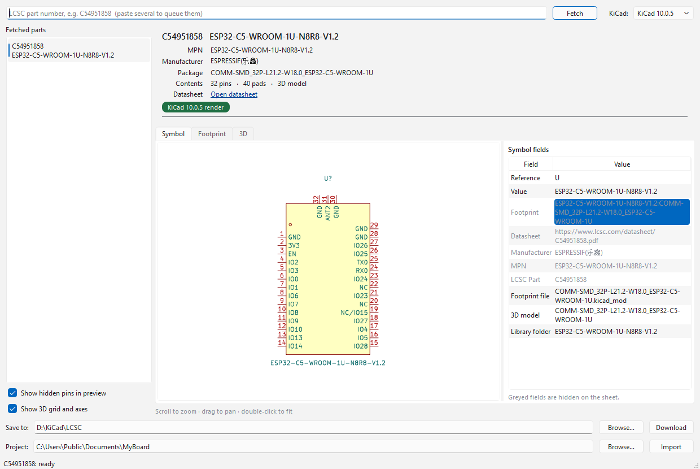
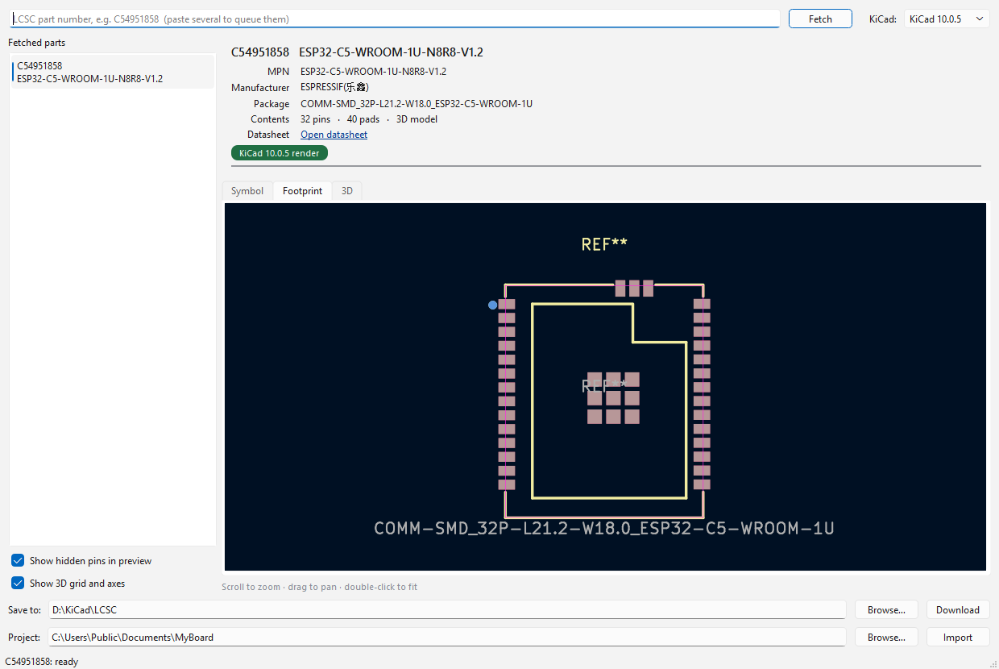
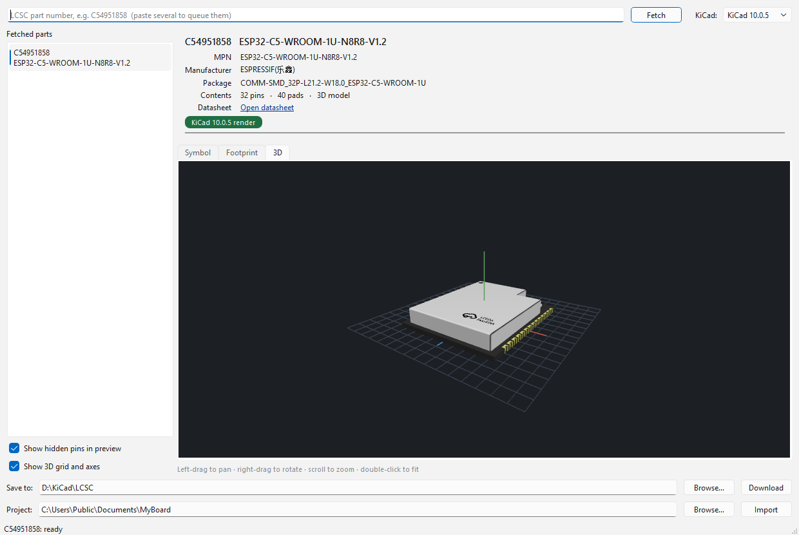

# LCSC → KiCad Downloader

Type an LCSC part number, **see** the schematic symbol, footprint and 3D model,
then save a folder KiCad can import. A desktop GUI for
[`easyeda2kicad`](https://github.com/uPesy/easyeda2kicad.py).



## What it does

- Fetches any LCSC / EasyEDA part by part number — `C54951858`, or a whole
  pasted list.
- Shows you the **symbol, footprint and 3D model before you commit to anything**.
- **Download** writes a self-contained folder to your library shelf, and offers
  to register it in KiCad's global libraries.
- **Import** drops the part straight into a KiCad project instead, registered in
  that project only.

## Why the preview is trustworthy

The part is converted into real KiCad files *first*, into a temporary staging
folder. The Symbol and Footprint tabs are then rendered by `kicad-cli` **from
those exact files**. So what you are looking at is KiCad's own drawing of the
library you are about to import — not EasyEDA's drawing of the source data.
Pressing **Download** copies the staged folder; nothing is converted a second
time.

That means a bad conversion is visible *before* it lands in your library, which
is the whole reason this exists. Running the CLI, you find out afterwards.

If KiCad isn't installed the previews fall back to EasyEDA's own rendering, and
the badge under the part details says so.

## How it compares

| | Runs as | Symbol / footprint preview | 3D preview | Writes KiCad files |
|---|---|---|---|---|
| **This app** | Windows desktop app | **Rendered by `kicad-cli` from the converted files** | **Yes, in-app** | Yes, one folder per part |
| [`easyeda2kicad`](https://github.com/uPesy/easyeda2kicad.py) — the converter this is built on | Command line | None | None | Yes |
| [kicad-lcsc-manager](https://github.com/hulryung/kicad-lcsc-manager) | KiCad plugin | EasyEDA's SVG API | No | Yes |
| [easyeda2kicad-web](https://github.com/hulryung/easyeda2kicad-web) | Web app | EasyEDA's data | Yes (Three.js) | Yes, as a download |

Every other tool previews EasyEDA's drawing of the *source* data. This one
converts first and then asks KiCad to draw the result, so what you approve is
the file you get. It is also the only desktop app of the four with a 3D view
built in.

## Requirements

- **Windows 10 or 11** (64-bit)
- **KiCad 8, 9 or 10** — optional, but without it you lose the accurate previews
- **Python 3.10 – 3.14** — only if you run from source
  ([python.org/downloads](https://www.python.org/downloads/))

> [!WARNING]
> Pick your KiCad version in the top-right **before** you download. It sets the
> `.kicad_sym` file-format version, and a library written for KiCad 10 **cannot
> be opened by KiCad 9 or 8**. This is the one mistake that costs you a
> re-download.

## Install

### Download the app (no Python needed)

Grab the zip from the [Releases page](https://github.com/somsinchai/LCSC_KICAD_downloder_GUI/releases),
unpack it anywhere, and run **`LCSC-KiCad-Downloader.exe`**.

It ships as a folder rather than a single `.exe`. That is deliberate: Qt is
LGPL-licensed, which requires that you be able to swap in your own build of Qt,
and keeping the DLLs as ordinary files next to the program is what makes that
possible. It also starts much faster than a self-extracting build would.

Windows SmartScreen will warn you the first time, because the executable isn't
code-signed — *More info* → *Run anyway*. If you'd rather not trust a binary
from a stranger, run from source instead; it's three commands.

To check your install, run `LCSC-KiCad-Downloader.exe --selftest`. It fetches a
known part, exercises every stage, and writes `selftest-report.txt` beside the
executable. Attach that file if you report a bug.

### Or run from source

```
setup.bat
```

Finds a suitable Python, creates `.venv`, and installs the dependencies. Then:

```
run.bat
```

### Or build the executable yourself

```
build.bat
```

Produces `dist/LCSC-KiCad-Downloader/` and a zip beside it.

## Using it

**1.** Type or paste a part number and press Enter. Paste several — separated by
spaces, commas or newlines — to queue them all.

**2.** Look at the three tabs.

- **Symbol** — the drawing, and the fields KiCad will attach to the placed
  symbol. Greyed rows are hidden on the schematic sheet. Right-click a row to
  copy it.
- **Footprint** — scroll to zoom, drag to pan, double-click to fit.
- **3D** — left-drag to pan, right-drag to rotate, scroll to zoom.





**3.** Then either:

- **Download** — saves the part to your library shelf (the "Save to" folder) and
  offers to add it to KiCad's *global* libraries, so it's available in every
  project.
- **Import** — copies the part into a KiCad project's `libs/` folder and adds it
  to *that project's own* library tables. Point "Project" at the folder holding
  the `.kicad_pro`; the button stays greyed until a project is found there.

Import writes its paths as `${KIPRJMOD}`, KiCad's variable for the project
folder, so you can move, zip or share the project and the libraries and 3D
models still resolve. Reopen the project in KiCad afterwards — it reads its
library tables when the project opens.

## What gets written

Each part becomes one self-contained folder, named after the part — and so is
everything inside it, so a folder tells you what it holds at a glance:

```
ESP32-C5-WROOM-1U-N8R8-V1.2/
├── ESP32-C5-WROOM-1U-N8R8-V1.2.kicad_sym
├── ESP32-C5-WROOM-1U-N8R8-V1.2.pretty/
│   └── COMM-SMD_32P-L21.2-W18.0_ESP32-C5-WROOM-1U.kicad_mod
└── ESP32-C5-WROOM-1U-N8R8-V1.2.3dshapes/
    ├── COMM-SMD_32P-….step
    └── COMM-SMD_32P-….wrl
```

That one name is also the KiCad library nickname, so the symbol's Footprint
field reads `ESP32-C5-WROOM-1U-N8R8-V1.2:COMM-SMD_32P-…`. The LCSC id isn't
lost — it's the symbol's "LCSC Part" field, and the description on both
library-table rows.

**Import** puts the same folder under `<project>/libs/` instead:

```
MyBoard/
├── MyBoard.kicad_pro
├── sym-lib-table      ← one row added, ${KIPRJMOD}-relative
├── fp-lib-table       ← one row added
└── libs/
    └── ESP32-C5-WROOM-1U-N8R8-V1.2/ …
```

If two different parts sanitise to the same name, you're asked whether to
replace the existing one or import alongside it as `…_2`, which becomes a
genuinely separate library with its own nickname.

## Adding the libraries to KiCad

**Close KiCad first.** It reads the library tables at start-up and rewrites them
on exit, so anything added while it's running gets thrown away.

The **Register in KiCad** button appends both rows to your global tables, after
writing a timestamped `.bak-` copy. To do it by hand instead:

- **Symbols** — Schematic Editor → Preferences → Manage Symbol Libraries… →
  Global Libraries → `+`, then the nickname and the path to `<part>.kicad_sym`.
- **Footprints** — PCB Editor → Preferences → Manage Footprint Libraries… →
  Global Libraries → `+`, path to the `<part>.pretty` folder.

Or edit `%APPDATA%\kicad\<version>\sym-lib-table` and `fp-lib-table` directly —
which is what the button does.

## Command line

```
run.bat --debug        keep a console window open with the log
run.bat --no-3d        start without the 3D tab
run.bat --selftest     check the install and write selftest-report.txt
```

The packaged build takes the same flags:
`LCSC-KiCad-Downloader.exe --selftest`.

## Troubleshooting

**Nothing happens when I run `run.bat`.** Run `setup.bat` first. If it still
does nothing, `run.bat --debug` gives you a console window and an error.

**`setup.bat` can't find Python.** Install 3.10–3.14 from python.org and tick
*Add python.exe to PATH* in the installer.

**Installing PySide6 fails.** PySide6 only ships wheels for 64-bit Python on
x86-64 Windows. There are none for 32-bit Python or Windows on ARM.

**The badge says "EasyEDA render".** KiCad wasn't found under
`C:\Program Files\KiCad\<version>\bin`. Everything still works; the previews are
just EasyEDA's rather than KiCad's.

**My symbols don't appear in KiCad.** Restart KiCad — it caches the library
tables at start-up. After an **Import**, close and reopen the *project*.

**I imported while KiCad was open.** The files and rows are written correctly,
but KiCad won't see them until the project is reopened. Until then, avoid
pressing OK in Manage Symbol Libraries: that rewrites the tables from KiCad's
in-memory copy and would drop the new row.

## Limitations

- Only tested on Windows. The Python is portable and the KiCad search paths
  cover Linux and macOS, but the launcher scripts are `.bat` and nobody has
  tried it there.
- One folder per part means two library-table rows per part. Convenient to
  share or delete a single part; your tables grow as you add parts.
- **Download** writes absolute 3D model paths, so moving a part folder
  afterwards breaks its 3D reference. **Import** writes `${KIPRJMOD}`-relative
  paths and does not have this problem.
- Import registers the libraries; it does not place the symbol on your
  schematic. KiCad has no supported API for that — the plugin API in KiCad 9
  and 10 covers the board editor only — and hand-editing a `.kicad_sch` risks
  a file you may have open.
- **Without KiCad installed**, symbols are written in the KiCad 6 file format.
  Every later version reads it, but you don't get to choose.
- Generated libraries follow `easyeda2kicad`'s output, not the
  [KiCad Library Convention](https://klc.kicad.org/).

## Privacy

The app talks to `easyeda.com` to fetch part data and 3D models, and to
`lcsc.com` for datasheet links. Nothing else leaves your machine. There is no
telemetry. Responses are cached under `%LOCALAPPDATA%\LCSC_KICAD_downloader`.

Not affiliated with LCSC, EasyEDA, JLCPCB or KiCad. The EasyEDA API is
undocumented and can change without notice.

## Credits

- [uPesy/easyeda2kicad.py](https://github.com/uPesy/easyeda2kicad.py) — does all
  the actual EasyEDA → KiCad conversion. This is a GUI around it, and it is used
  unmodified.
- [KiCad](https://www.kicad.org/) — `kicad-cli` renders the previews.
- [Qt / PySide6](https://doc.qt.io/qtforpython-6/) — the interface and the 3D view.

Bug reports are welcome — please include the LCSC part number, since almost
every bug here is specific to one component.

## License

GNU Affero General Public License, version 3 (AGPL-3.0-only) — see
[LICENSE](LICENSE). Copyright © 2026 somsinchai.

**Why AGPL.** The conversion is done by
[`easyeda2kicad`](https://github.com/uPesy/easyeda2kicad.py), which is AGPL-3.0.
This app imports it directly rather than shelling out to it, so the two form a
single program and the whole thing carries the same licence. That was upstream's
choice; honouring it is the price of not reimplementing their converter. ("Or
any later version" isn't offered here, because upstream doesn't offer it either.)

What that means for you:

- **Using it — no obligations at all.** Download parts, use them in commercial
  designs, sell the boards. The licence covers this program's source code, not
  the KiCad libraries it produces or the hardware you design with them.
- **Publishing a modified copy** — release your changes under AGPL-3.0 too.
- **Section 13, the "network" clause** — this is a desktop application. It runs
  on your machine, has no server, and offers nobody remote interaction, so
  section 13 never comes into play. It would if you turned this into a web
  service: then you'd have to offer your users the source.

Qt is used through PySide6 under the LGPL-3.0. The packaged build bundles Qt;
see [THIRD-PARTY-LICENSES.md](THIRD-PARTY-LICENSES.md) for the components it
ships and where to get their source.
